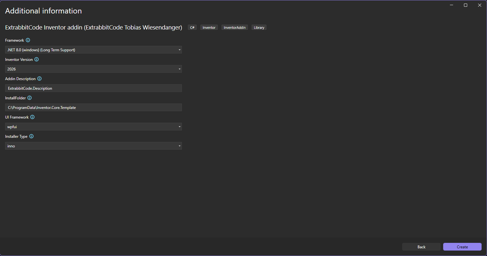
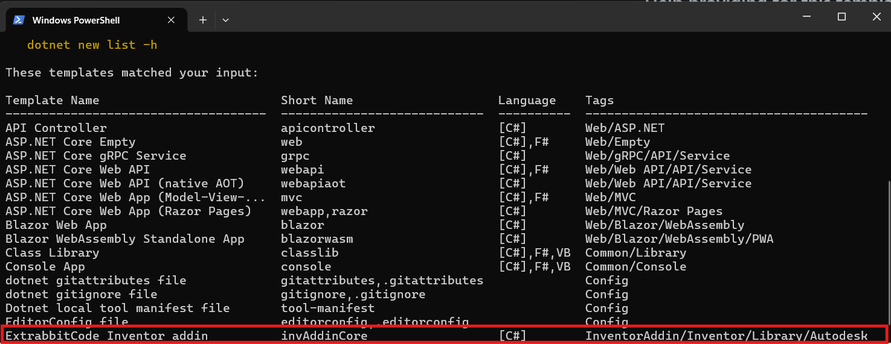
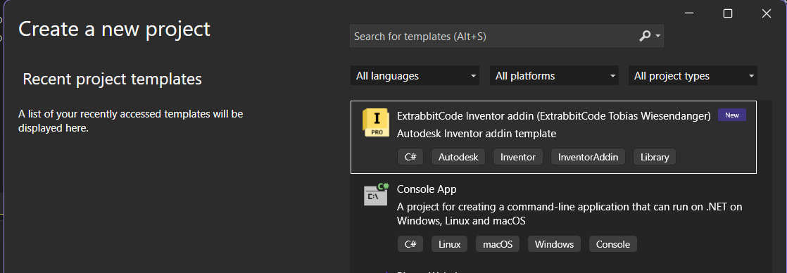

- [Introduction](#introduction)
  - [Version](#version)
  - [Demo](#demo)
    - [Use with User Interface](#use-with-user-interface)
    - [Use on the commandline](#use-on-the-commandline)
  - [Help providing for this template](#help-providing-for-this-template)
  - [UI](#ui)
    - [WPF](#wpf)
  - [Info dialog](#info-dialog)
  - [Logger](#logger)
  - [Add a new button / command](#add-a-new-button--command)
    - [Create a Icon folder](#create-a-icon-folder)
    - [React on click event](#react-on-click-event)
    - [Add to interface](#add-to-interface)
  - [Globals](#globals)
  - [Add Settings](#add-settings)
  - [Use the installer to create a setup](#use-the-installer-to-create-a-setup)
    - [Inno Setup](#inno-setup)
  - [Build script](#build-script)
  - [Other](#other)
    - [Change Inventor Version](#change-inventor-version)
    - [Use iLogic](#use-ilogic)
  - [Analyzer](#analyzer)
  - [Troubleshooting](#troubleshooting)
    - [There was an error opening the file](#there-was-an-error-opening-the-file)
    - [All my references are missing](#all-my-references-are-missing)

# Introduction


If you ever copied multiple things from other addins over and over again, then you will like this template. The idea is to provide a template that already includes alot of standard features that every addin needs. If you want to there is nothing to change at all. You could use a generated addin from this template right out of the box. Things like guids are already generated. There is also a build script to automatically deploy it to a predefined folder.

This template is based on the ***dotnet templating.*** See [Templating](https://docs.microsoft.com/en-us/dotnet/core/tools/custom-templates)

The following features are provided at the moment:

- setup functioning Inventor addin in minutes
- default logging with log4net
- dark and Lighttheme support
- default buttons for all environments
- info dialog (show patch notes) (wpf or winforms)
- unload and load of addin
- reset of user interface
- loading settings file
- structured code base to extend
- nullability
- enforced coding style with editorconfig
- build script
- inno setup installer script or none
- documentation for using and extending the addin
- nuget package for inventor reference See [Autodesk.Inventor.Sdk](https://www.nuget.org/packages/Autodesk.Inventor.Sdk/)

Feel free to ask for other features by emailing me <tobias.wiesendanger@gmail.com> or by opening a issue.

## Version

The template is setup for Inventor 2025 and higher. It uses the .net 8.0 or higher framework.
By default the highest currently supported Inventor and .net version is used. You can change this in creation dialog.

## Demo

The following options are currently possible:

- Framework: .net 8.0 / .net 9.0
- Inventor Version: 2026 / 2025
- Addin Description: your description here
- InstallFolder: C:\ProgramData\YourCompany\YourAddinName (as an example)
- UI Framework: WPFUI / Winforms
- Installer Type: Inno Setup / none

### Use with User Interface

After installing the template TODO



### Use on the commandline

```powershell
dotnet new invAddinCore `
  --name "ExtrabbitCode.MyInventorAddin" `
  --framework "net8.0-windows" `
  --inventorVersion "2026" `
  --addinDescription "My custom Inventor Addin for part automation" `
  --installFolder "C:\ProgramData\MyInventorAddin" `
  --ui "wpfui" `
  --installerType "inno"
```

This will create a new project in the current folder with the name `ExtrabbitCode.MyInventorAddin`.

## Help providing for this template

Feel free to fork and then create a merge request. The template itself cannot be run directly.
This is mainly because there are some variables that get only replaced when using `dotnet new`.

It's best to create an addin based on the template and develop inside of that. If it's working copy changes to the template.

### Use Installer Script

There is a script that allows to easily update the template locally for testing. You can find it in the `scripts` folder. Just run `UpdateTemplate.cmd` and it will copy the template files into the local template folder. After that you can use `dotnet new invAddinCore` to create a new addin based on the template.

After installing check with `dotnet new --list` if the template is listed. It should be listed like this:



It should be listed now when creating a new project like this:



## UI

There are two options provided. One is using wpf and the other is using winforms. Depending on what you prefer you can use either one. Read the corresponding section to get started. I personally recommend wpf, mainly because it is more modern and scales better on high dpi screens.

### WPF

The wpf template uses wpfui for theming. You can find more information about it here: [WPF UI](https://github.com/lepoco/wpfuiI)
There is a sample info dialog that shows how to use it. Make sure to also set the theme when showing a dialog.

This can be done like this:

```csharp
InfoDialog infoDialog = new();
SetDialogTheme(infoDialog);
infoDialog.ShowDialog();
```

Look for the 'Button.cs' file to see how it is used.

## Info dialog

There is a default dialog provided. Depending on if you choose wpf or winforms for the addin, the dialog will be created accordingly.


If you plan to use it, you should edit the file inside of the `Resources` folder. Whatever text is inside of the `versionhistory.txt` will be shown in this dialog.


## Logger

Currently you need to be cautious when using a third party library. If you use a library that is also used by autodesk, you might run into problems. Autodesk uses three different logging libraries currently. NLog, Serilog and Microsoft.Extensions.Logging, so there is not much left to choose from. With `log4net` you should be safe.

Most of the time you can just create a field like this:

```csharp
    private static readonly ILog Logger = LogManagerAddin.GetLogger(typeof(UiButton));
```

and then use it like this:

```csharp
    Logger.Info("This is an info message");
    Logger.Warn("This is a warning message");
    Logger.Debug("This is a debug message");
    Logger.Error("This is an error message");
```

For further customization you can look into the `log4net.config` file. By default the log file will be created in the default windows temp folder.

So normally a folder will be created here: `C:\Users\YourUser\AppData\Local\Temp\YourAddinName\YourAddinName.log` and the log file will be created there. You can change this in the config file if you want to. Just make sure to not write it into a folder where you dont have write access, otherwise the logging will not work.

## Add a new button / command

There are some default buttons that show how a buttons has to be setup, but I would like to show a bit more insight here, because that is a step that probably everyone needs to do.
Also every addin out there does that a bit different.

Start in StandardAddinServer.cs by adding a new field. There should be two fields.


Remove the existing ones if you dont need them and add new ones here. If you want to follow the microsoft best practise use a "_" before the name.

Next, look inside of the `Activate` method. There is a sample line that looks like this:

```csharp
_info = UiDefinitionHelper.CreateButton("Info", "InventorTemplateInfo", @"UI\ButtonResources\Info", theme);
```

Follow the exact same principel:

```csharp
_yourFieldName = UiDefinitionHelper.CreateButton("DisplayName", "InternalName", @"UI\ButtonResources\YourCommandName", theme);
```

For InternalName it might be a goode idea to also add your addin name as a prefix to not risk any conflicting names. This has to be a unique name and also does not collide with already existing ones from autodesk inventor.
Make sure to also add it to `_buttonDefinitions`. This makes sure that the button can be deleted when unloading the addin.

### Create a Icon folder

To provide icons for your own button, make sure to create a new Folder inside of `UI\ButtonRessources` Name it the as the name you used for creating the button.
Inside of it you need to provide 4 different icons. There are two sizes that need to be provided. (16x16 adn 32x32) Both of them have to be named exactly like those in the default folders.

Make sure that you provide icons for the dark and the lightTheme. If you dont want to support the darkTheme, feel free to just copy lightTheme icons and rename them.
They have to be provided as png.

### React on click event

To react on the user clicking your button, you need to add a case in the `UI\Button.cs`

```csharp
case "InventorTemplateDefaultButton":
    MessageBox.Show(@"Default message.", @"Default title");
    return;
case "InventorTemplateInfo":
    var infoDlg = new FrmInfo();
    infoDlg.ShowDialog(new WindowWrapper((IntPtr)Globals.InvApp.MainFrameHWND));
    return;
default:
    return;
```

Just add another case exactly the same way as those that are already provided. The case string has to be the internal name you defined while creating the button.
After that call your method from here, to do whatever the button should do.

### Add to interface

To make sure that your button is shown in the interface you need to edit the `AddToUserInterface`. Depending on how and where you want to show it, the steps will be different.

IF you want to create a new **tab** then do the following:

```csharp
var yourTab = UiDefinitionHelper.SetupTab("DisplayName", "InternalName", onWhatRibbonToPlace); // use the alreay provided variables for onWhatRibbonToPlace
```

This is a tab


Make sure to also add the tab to `_ribbonTabs`. As with the buttondefinitions, this allows to remove them easily.

Add a panel to the tab:

```csharp
var yourPanel = UiDefinitionHelper.SetupPanel("DisplayName", "InternalName", yourTab);
```

This is a panel


Make sure to also add the tab to `_ribbonPanels`. As with the buttondefinitions, this allows to remove them easily.

As a last step, check if your button is not null (could be if Buttodefinition.Add did not work), and then add it to your panel.

```csharp
if (_yourButton_ != null)
{
    var yourButtonRibbon = yourPanel.CommandControls.AddButton(_yourButton_, true);
}
```

## Globals

There is a file called `Globals.cs`, which can be used to get a reference to the `Application`. Use it like this:

```csharp
Globals.InvApp
```

More can be added here but should be used with caution. The more you add here, the more you risk to create a mess.

## Add Settings

For settings you should use applicationSettings. This allows to add typesafe settings and no dependencies / nuget packages are needed.

Just add a new setting here:

TODO LOGPATH NO LONGER USED LIKE THIS


This allows to access them like this:
`var logPath = Properties.Settings.Default.logPath;`

Keep in mind that depending on if the setting is a user setting or an application setting, they behave different.
Application settings get their own section in app.config and cannot be changed while running. User settings can but are now overwritten by a special path depending on the user.

Read more here: [Application settings](https://stackoverflow.com/questions/2101273/how-do-i-retrieve-applicationsettings-from-a-loaded-app-config-file/9704380#9704380)

## Use the installer to create a setup

There are two options provided. One is using inno setup and the other is using none. Depending on what you prefer you can use either one. Read the corresponding section to get started.

### Inno Setup

The installer uses inno. Make sure to install [Setup](https://jrsoftware.org/isinfo.php).

Edit the sample script to your liking. At least the header needs some modifications. You can find the script inside of the `Installer` folder. The relevant part to change is this one:

```json
#define MyAppName "InventorTemplate"
#define MyAppVersion "0.0.0.1"
#define MyAppPublisher "Company"
#define MyAppURL "http://www.company.com"
```

Also make sure to change the license.txt file if you dont plan to release your addin with a GNU license.

> Before running make sure to create a release build of your addin. The installer script looks for the files inside of the release folder.

## Build script

There is a script that is run each time build is used. Look for `Buildscript.cmd` in the root folder. It is used to embed the manifest into the dll file and to copy the addin into the standard inventor addin folder. Also some resources are copied if needed.

The embedding is needed. Without the addin will not load correctly. You can check if this was successfull by opening the dll file inside of visual studio.


If this is not present, something went wrong. Try checking the path to mt.exe. This can also be provided from other sources.

After this step, if the addin is already existing, the addin file will be deleted. After this the file has to be copied from your debug folder to this folder.
This will be done automatically by the script.

The last and most important stop is to copy everything belonging to the addin into the predefined installfolder. Here the path that you provided at the begining is used.


## Other

### Change Inventor Version

To change the inventor version, you need to edit the project file. Look for `<InventorVersion>$(InventorVersion)</InventorVersion>` and change it to the desired version. Even better you look for the `Directory.Build.props` file in the root folder and change it there. This way all projects will use the same version.

### Use iLogic

To use iLogic dll's, you need to edit the project file. You can add `<UseILogic>true</UseILogic>`.

## Analyzer

The analyzer is pretty strict on purpose. It forces you to use best practises and avoid common mistakes. If it is to strict for you, feel free to edit the ruleset file called `.editorconfig` in the root folder. By default using `var` is not allowed. If you want to change this, just edit the file and change the corresponding rule.

Also `Warnings` are treated as errors. If you want to change this, you can do this by removing this line from the project file:

```xml
<TreatWarningsAsErrors>true</TreatWarningsAsErrors>
```

## Troubleshooting

### There was an error opening the file

If your addin for some reason doesn't load, check what the Add-Ins Dialog shows.


If there was an error opening the file is shown. Make sure that it points to the right dll file. It's not enough to just give the path.
So this will not work:


but this is fine:


### All my references are missing

Try dotnet restore inside of the developer console to download any referenced nuget packages.
For all the other references, there are different things that can lead to this:

1. Try to unload the project and reload with dependencies.
2. Remove project and readd it to the solution.
3. Remove this from the project file (make sure to get a backup from the file first)

```csharp
<Target Name="EnsureNuGetPackageBuildImports" BeforeTargets="PrepareForBuild">
  <PropertyGroup>
    <ErrorText>This project references NuGet package(s) that are missing on this computer. Enable NuGet Package Restore to download them.  For more information, see http://go.microsoft.com/fwlink/?LinkID=322105. The missing file is {0}.</ErrorText>
  </PropertyGroup>
  <Error Condition="!Exists('$(SolutionDir)\.nuget\NuGet.targets')" Text="$([System.String]::Format('$(ErrorText)', '$(SolutionDir)\.nuget\NuGet.targets'))" />
</Target>
```

This should allow to fix everything other than nuget packages. To restore those use this:
`dotnet restore` inside of the developer shell.
